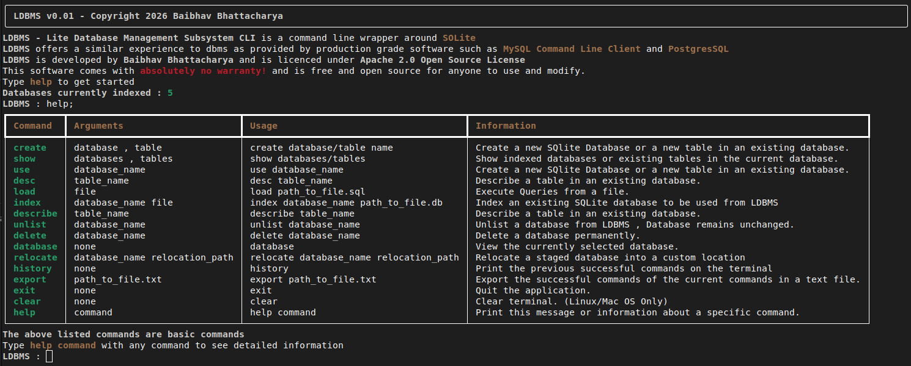

# LDBMS &mdash; Lite Database Management Subsystem
<strong>LDBMS</strong> which is short for <i>Lite Database Management Subsystem</i> is a command line **REPL** for <strong>SQLite</strong>. It is built for college lab practicals and is designed with the student in mind. LDBMS is the perfect software for leaening SQL Queries with a user friednly interface and a zero headache setup.  

  

<strong>LDBMS</strong> is completely written in python and has minimal dependencies. It is available for both Windows and Linux.  <strong>LDBMS</strong>  will also be availabe for download from the <strong>Microsoft Store</strong> upon release. 
  

# Unique features of LDBMS
- <strong>Managing multiple local databases</strong>  
**LDBMS** directly addresses the biggest problem with local databases which is, messy and long paths. **LDBMS** solves that by allowing the user to index , create and delete local databases from within the application and switch between them using the `use <database>` command  

- <strong>Compatibility with MySQL Command Line Client</strong>  
**LDBMS** borrows many commands like `create` , `show` , `use` from the **MySQL Command Line Shell** to avoid introduction of extra verbose commands and offer a relatable experience. Hence it is suitable for most curriculum which use MySQL as their Database Management System. In v0.01 , Basic MySQL Commands are supported, more will be added later.

-  <strong>Rich text and expressive error handling</strong>  
**LDBMS** uses the Rich framework for printing styled text on the terminal and for drawing pretty tables. It directly exposes both user and system errors with user friendly error messages and panels to isolate malformed and incorrect commands tailored towards users starting out with learning SQL.

- <strong>Zero Deployment & Installation headaches</strong>  
**LDBMS** is a serverless solution for practicing SQL and Database Management hence, it is essentially a single executable which you can download and run instantly. It doesn't need system applications , complicated database management applications and complicated system permissions. It manages databases , history , configuration locally using files. It does not need an internet connection or any port or socket configurations. Hence **LDBMS** is perfect for college labs and begineer users as it doesn't have users , passwords and other complications by design.

- <strong>Cross platform support</strong>  
Being developed with Python, LDBMS supports both Windows and Linux. It also supports Mac OS but , I will not be releasing a mac os binary as i don't have an apple computer.

# Supported commands in LDBMS
**LDBMS** supports a large number of commands which perform specific functions. To learn about their usage and arguments , check out the usage documentation.  
<a href="commands.md"><u>Supported Commands - Commands.md</u></a>

# Multiline commands in LDBMS
**LDBMS** differs from other SQL REPL when it comes to formatting and multi line commands, to learn more, check out the formatting documentation.  
<a href="commands.md"><u>Terminal Formatting & Inlining - Terminal.md</u></a>

# Credits & Other Information
This software comes with <strong>absolutely no warranty</strong> and is free and open source for anyone to use and modify.  
<strong>LDBMS</strong> is completely developed by <strong>Baibhav Bhattacharya</strong> and is licensed under <a href='LICENSE'><strong>Apache 2.0 Open Source License</a>