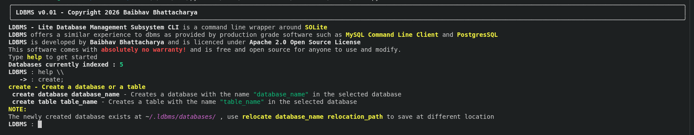

# Terminating commands in LDBMS
Each **LDBMS** command is terminated with a `;` (semicolon) , if it is not included at the end of a command , it will throw an error. Read the *Multiline Commands* section below to see how multiline commands work

# Multiline Commands in LDBMS
**LDBMS** does not audtoamtically collapse the terminal like other sql repl. It will automatically send the command as soon as you hit enter and it will throw an error if not terminated correctly with a `;` (semicolon). To type multiline commands you have to use the explicit inline character `\\` at the end of every line with a precedeing whitespace.
At the last line you can terminate with the semicolon to send the command.
### **EXAMPLE**
` CREATE TABLE student_15 \\`  
`(name varchar(20), \\`   
`roll_no int(3), \\`  
`phone_no int(3), \\`  
`email varchar(50));`

The `\\` is used as the inline character because it doesn't affect standard SQLite Queries. 

  

# Case Sensitivity
Commands in **LDBMS** aren't case sensitive meaning writing `HELP` and `help` or `HeLp` will all work for shell commands, but , for paths and SQL Queries , standard SQLite Rules apply.  
**User defined symbols** are case sensitive while **Keywords** are not case senstive.